# RegimeCurve-GAN

RegimeCurve-GAN is a conditional generative model for US Treasury yield curves. Given the preceding three business days of the curve, it generates ten alternative scenarios, each covering the next ten business days.

The project was designed for scenario generation rather than point forecasting. A useful model should therefore satisfy two objectives at the same time:

1. each simulated path should be financially and temporally plausible;
2. repeated simulations from the same context should produce diverse but credible futures.

The implementation combines a regime-aware conditional Wasserstein GAN, an interpretable Nelson–Siegel representation, an orthogonal maturity-spline shape head, heavy-tailed hierarchical noise, autoregressive stochastic experts, two specialised critics, latent-information recovery, and explicit level-neutral shape-covariance matching.

## Contents

- [Executive summary](#executive-summary)
- [Iterative development and empirical progress](#iterative-development-and-empirical-progress)
- [Architecture](#architecture)
- [Design choices](#design-choices)
- [Data and preprocessing](#data-and-preprocessing)
- [Training objective](#training-objective)
- [Running the project](#running-the-project)
- [Reproducing results](#reproducing-results)
- [Evaluation](#evaluation)
- [Assumptions and constraints](#assumptions-and-constraints)
- [Limitations](#limitations)
- [Future work](#future-work)
- [Use of AI tools](#use-of-ai-tools)

## Executive summary

The final model is not the first plausible-looking GAN run. It is the result of repeatedly testing whether apparent diversity was economically meaningful. The initial generator produced curves that were almost parallel. Increasing the noise created dispersion but also unrealistic factor variance. The final architecture therefore separates broad Nelson–Siegel movements from six orthogonal spline shape coordinates and trains covariance across repeated futures from the same conditioning context.

The supplied final evaluation contains only ten scenarios, as requested by the task. It demonstrates that the parallel-collapse problem is substantially reduced, but it is too small for definitive covariance or tail conclusions. The most important final metrics are:

| Diagnostic | Ten-scenario result | Interpretation |
|---|---:|---|
| Mean absolute daily move | 3.13 bp | Plausible average movement |
| Maximum daily move | 16.08 bp | Large-noise outliers are controlled |
| Correlation-matrix error | 0.642 | Cross-maturity dependence is close to history |
| PC1/PC2/PC3/PC4 spread ratios | 0.43 / 0.84 / 0.60 / 0.65 | Good PC2 coverage; leading and higher modes remain under-dispersed |
| Generated/historical shape-variance ratio | 0.437 | Improved from 0.216, but still below the desired 0.6–1.4 range |
| Relative shape-covariance error | 0.612 | Improved from 0.810 after within-context training |
| Less representative than 95% of history | 0/10 | No generated scenario is isolated from conditional history |
| Outside any factor 5–95% interval | 4/10 | Too noisy to interpret reliably with only ten draws |

The correct conclusion is therefore not that calibration is finished. The model now generates non-parallel, historically recognisable curve shapes and materially better conditional covariance, while retaining an identifiable shortfall in total shape variance. A reportable final assessment should use at least 100 scenarios per context and several training seeds.

## Iterative development and empirical progress

### Step 1: initial conditional WGAN-GP

The first implementation combined a GRU context encoder, four latent regime experts, Student-t innovations, a temporal critic, a shape critic, Nelson–Siegel factors, and residual PCA. It produced smooth curves, but visual inspection showed that nearly all scenarios retained the same maturity profile. The daily cross-maturity correlation error was 3.563. Non-zero numerical dispersion was not accepted as evidence of useful scenario diversity.

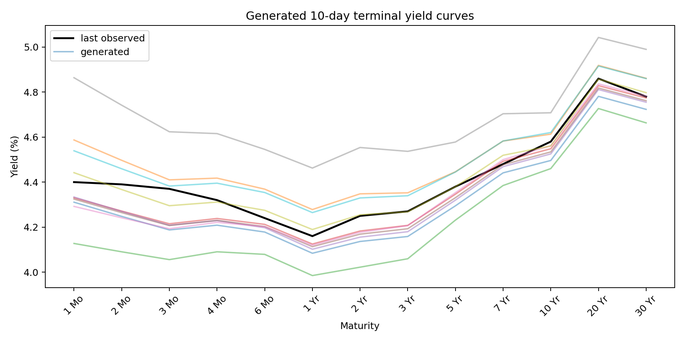

### Step 2: aggressive variance-prior experiment

The author explicitly requested greater model complexity, very large noise, and a large variance prior to test whether the failure was simply insufficient stochasticity. Factor-specific scales, heavy-tailed regime multipliers, latent recovery, path repulsion, and stronger diversity terms were introduced. Diversity increased, but the experiment overshot: the level, slope, and curvature standard deviations reached 66.60, 30.47, and 15.88 bp, and mean terminal dispersion reached 39.31 bp. This run demonstrated that generic noise creates wide curves without guaranteeing calibrated shapes.

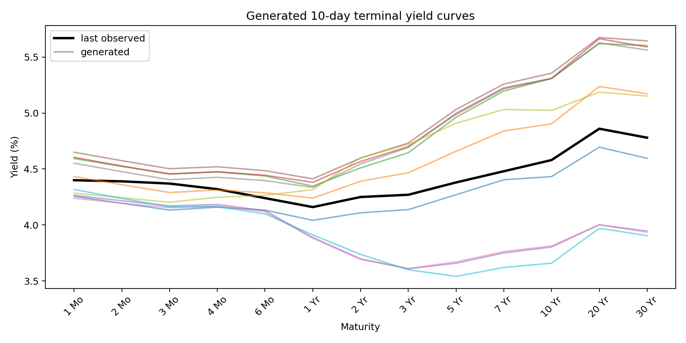

### Step 3: conditional calibration and orthogonal spline representation

The author requested comparisons against conditionally similar historical episodes rather than an unconditional archive. Evaluation was expanded to use non-overlapping neighbours matched on current level, slope, curvature, and recent volatility. Factor-path envelopes, terminal boxplots, maturity envelopes, PCA representativeness, and correlation heatmaps were added.

The author continued to reject the curves as too parallel. That diagnosis identified a representation bottleneck: three residual PCA factors preserved only dominant historical directions. They were replaced by six cubic-spline coordinates projected onto the orthogonal complement of the Nelson–Siegel basis. The resulting coordinates cannot reproduce another level, slope, or broad-curvature movement and must represent local twists and butterflies. PC2 and PC3 spread rose to 0.73 and 0.83, correlation error fell to 0.785, and slope/curvature standard deviations reached 8.55/6.27 bp. A 68.56 bp daily outlier nevertheless showed that heavy tails still required control.

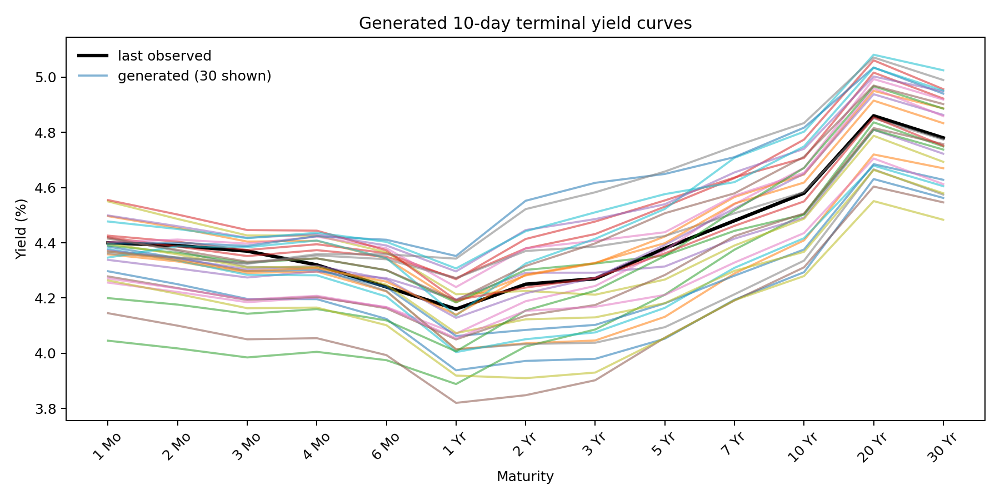

### Step 4: explicit PC4 and local-butterfly modelling

The author asked specifically for better PC4 coverage and shape covariance. A direct path-level target was added in the orthogonal spline subspace, together with a whitened covariance loss that prevents PC1 from numerically overwhelming weak historical modes. PC4 spread increased from 0.47 to 0.82. However, total level-neutral shape variance was only 0.216 of history and relative covariance error remained 0.810. This exposed a distinction between covering a low-variance mode and reproducing the total covariance magnitude.

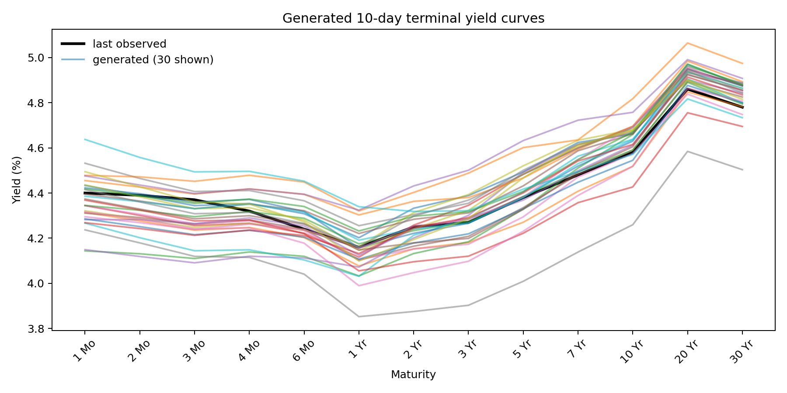

### Step 5: within-context covariance matching

The author questioned why generated shape covariance remained pale despite broader PC3–PC4 coverage. Inspection found a training/evaluation mismatch. Training covariance was calculated across mixed contexts, so differences between conditional means could satisfy the loss. Evaluation instead sampled many futures from one fixed context. The final objective generates eight futures per context, removes each context's own generated mean shape, and calculates covariance only from the remaining within-context variation. A separate trace loss matches total shape energy, and checkpoint selection uses the same conditional criteria.

On the ten-scenario evaluation, shape-variance coverage increased from 0.216 to 0.437, relative covariance error decreased from 0.810 to 0.612, correlation error improved from 0.864 to 0.642, and the maximum daily move decreased from 45.23 to 16.08 bp. PC4 settled at 0.65 rather than the previous 0.82, reflecting a more balanced objective rather than exclusive optimisation of one small component.


| Stage | Level std | Slope std | Curvature std | PC2 | PC4 | Shape variance | Correlation error | Max daily move |
|---|---:|---:|---:|---:|---:|---:|---:|---:|
| Initial | — | — | — | — | — | — | 3.563 | — |
| Aggressive noise | 66.60 | 30.47 | 15.88 | — | — | — | 1.295 | 20.97 bp |
| Orthogonal spline | 15.96 | 8.55 | 6.27 | 0.73 | 0.47 | — | 0.785 | 68.56 bp |
| PC4 enhanced | 12.67 | 6.86 | 8.32 | 0.54 | 0.82 | 0.216 | 0.864 | 45.23 bp |
| Within-context final | 18.32 | 8.72 | 7.03 | 0.84 | 0.65 | 0.437 | 0.642 | 16.08 bp |

## Architecture

### Overview

```text
Previous three curves
        │
        ▼
Nelson–Siegel and orthogonal spline encoder
        │
        ▼
GRU context encoder ───────────────► regime probabilities
        │                                      │
        ├──────── path-level noise              │
        └──────── daily shock noise             │
                        │                       │
                        ▼                       ▼
       sampled stochastic expert ◄──────── discrete regime
                        │
                        ▼
       autoregressive drift and volatility
                        │
                        ▼
       separate drift and factor shock scales
                        │
                        ▼
        differentiable yield-curve reconstruction
                 │                         │
                 ▼                         ▼
          temporal critic             shape critic
```

### 1. Financial factor representation

Generating all maturities independently makes it easy for a neural network to create irregular curve shapes and difficult to learn the strong dependence between maturities. Each observed curve is instead represented as

$$y_t(\tau)=\beta_{0,t}+\beta_{1,t}\frac{1-e^{-\lambda\tau}}{\lambda\tau}+\beta_{2,t}\left(\frac{1-e^{-\lambda\tau}}{\lambda\tau}-e^{-\lambda\tau}\right)+\varepsilon_t(\tau).$$

The first three coefficients approximately describe level, slope, and broad curvature. The remaining residual is represented by six smooth cubic-spline coordinates over log maturity. The spline dictionary is projected onto the orthogonal complement of the Nelson–Siegel span and then orthonormalised. These coordinates therefore cannot reproduce another parallel shift: they must describe local twists, butterflies, and long-end deformations. This replaces residual PCA, whose variance ordering concentrated capacity in a few historically dominant directions. The default latent curve state has nine dimensions.

Both the factor transform and its standardisation statistics are fitted using training data only.

### 2. Context encoder and latent regimes

A GRU encodes the previous three latent curve states. Its output is used both as a conditioning vector and to infer probabilities over four latent regimes. Straight-through Gumbel–Softmax selects one expert per scenario during training, while categorical sampling is used during inference. This prevents averaging incompatible regime behaviours.

The regimes are not given economic labels during training. They are intended to let different experts specialise in behaviours such as parallel shifts, steepening, flattening, or high-volatility movement. Because the regimes are latent, their numerical labels are arbitrary and must be interpreted after training.

### 3. Heavy-tailed hierarchical noise

Two types of randomness are supplied to the generator:

- path-level noise controls the overall ten-day scenario;
- daily noise introduces local shocks along the simulated path.

This division encourages coherence across the horizon while avoiding deterministic trajectories. Daily innovations follow a Student-\(t_5\) prior rather than a Gaussian prior. Regime-dependent scales allow calm and stressed scenarios, while factor-specific positive scales let curvature receive larger shocks without injecting independent noise directly into every maturity.

### 4. Autoregressive stochastic regime experts

Each regime expert is a GRUCell decoder. At every forecast day it consumes the previous latent state, encoded context, path code, and a fresh daily innovation. Separate heads predict drift and conditional volatility. Drift is capped separately, and learned mean reversion prevents persistent ten-day trends. Shock scales are initialised asymmetrically at `0.03` for level, `0.07` for slope, `0.09` for curvature, and `0.08` for each orthogonal spline coordinate. This gives local shape modes enough prior variance to compete with the dominant level factor.

Each expert also predicts a path-level target in the orthogonal spline subspace. Mean reversion pulls only the six spline coordinates towards this scenario-specific target over the forecast horizon. This direct latent-to-shape connection prevents weak butterflies from being averaged away inside the recurrent decoder and cannot create an additional parallel level shift.

A fixed global multiplier was replaced with separate positive drift and shock scales. The calibrated Student-\(t_5\) prior uses a base scale of `0.75` and regime multipliers `[0.7, 0.9, 1.1, 1.5]`.

### 5. Differentiable curve decoder

The generated latent states are converted back to all 13 maturities using the fitted Nelson–Siegel basis and orthogonal cubic-spline basis. Because reconstruction is implemented in PyTorch, gradients from curve-level losses and the shape critic pass directly into the generator. The spline span adds maturity-specific capacity without generating 13 independent noisy yields.

### 6. Dual critics

One discriminator was not expected to assess temporal behaviour and maturity geometry equally well. The model therefore uses two Wasserstein critics.

The **temporal critic** is a bidirectional GRU applied to the complete sequence consisting of three conditioning days and ten future days. It evaluates continuity at the forecast boundary, path dynamics, and temporal dependence.

The **shape critic** processes yield levels together with first and second differences across maturity. It focuses on cross-maturity consistency, excessive kinks, slope, and curvature. Both critics receive a minibatch-standard-deviation feature so batches of nearly identical scenarios are detectable.

## Design choices

### Why generate factors rather than yields directly?

Treasury maturities are highly correlated, and most curve variation lies in a small number of economic directions. The factor representation reduces dimensionality, improves sample efficiency, and makes generated scenarios easier to diagnose. Orthogonal spline coordinates prevent the model from being forced into an exact Nelson–Siegel family while reserving their capacity for genuine maturity-relative changes.

### Why WGAN-GP?

The dataset is modest relative to typical image-generation datasets, and the target distribution is continuous and strongly correlated. Wasserstein training supplies a smoother critic signal than a binary GAN objective. Gradient penalties constrain both critics and improve stability without clipping their weights.

### Why use learned regimes?

Yield-curve dynamics are non-stationary. A single generator can average incompatible behaviours and produce conservative scenarios. A learned mixture of experts provides regime-dependent capacity without requiring subjective historical labels.

### Why use explicit statistical losses?

Adversarial loss alone does not guarantee correct marginal volatility or cross-maturity covariance. The initial experiment produced visually plausible curves but underestimated daily movement and showed limited curvature diversity. Moment and covariance losses were therefore included as auditable, financially meaningful training targets.

## Data and preprocessing

The supplied workbook contains 7,758 dated observations from 1990 to 2024 and 13 Treasury maturities from one month to 30 years.

Preprocessing performs the following steps:

1. parse dates and sort observations from oldest to newest;
2. remove duplicate dates;
3. discard the single archive row containing no reported yields;
4. interpolate missing tenors across maturity within the same date;
5. fit the Nelson–Siegel scaling and orthogonal spline-coordinate scaling on training rows only;
6. construct rolling windows with three context days and ten target days;
7. assign a window to a split using the final date of its target horizon.

The default chronological split is:

| Partition | Target-horizon end date |
|---|---|
| Training | Up to 31 December 2017 |
| Validation | 1 January 2018 to 31 December 2020 |
| Test | 1 January 2021 onward |

A random split was deliberately avoided because neighbouring rolling windows overlap heavily and would leak near-identical market states between training and evaluation.

## Training objective

The critics minimise the conditional Wasserstein objectives with gradient penalties. The generator objective is

$$\mathcal L_G=\mathcal L_{\mathrm{adv}}+\lambda_{\mathrm{smooth}}\mathcal L_{\mathrm{smooth}}+\lambda_{\mathrm{moment}}\mathcal L_{\mathrm{moment}}+\lambda_{\mathrm{cov}}\mathcal L_{\mathrm{cov}}+\lambda_{\mathrm{div}}\mathcal L_{\mathrm{div}}+\lambda_{\mathrm{regime}}\mathcal L_{\mathrm{regime}}.$$

- **Adversarial loss** encourages temporal and cross-maturity realism.
- **Smoothness loss** penalises excessive second differences across maturity.
- **Moment loss** matches the mean and volatility of daily yield changes.
- **Covariance loss** matches the covariance matrix of daily changes across maturities.
- **Within-context shape-covariance loss** generates eight futures from each context, removes that context's generated mean shape, and matches the remaining covariance to historical ten-day shape covariance. Between-context changes can no longer satisfy a loss intended to measure stochastic scenario diversity.
- **Within-context whitened shape loss** diagonalises historical level-neutral covariance and scales each of its first six modes to unit variance before matching same-context generated residuals. Consequently, a historically small PC4 butterfly remains visible to the objective without dominating total variance calibration.
- **Shape-trace loss** separately matches total level-neutral covariance energy. This prevents good PC4 coverage from concealing severe under-dispersion in the historically dominant shape mode.
- **Economic diversity loss** rewards latent noise that changes level, slope, and curvature, with additional weight on curvature.
- **Latent-information loss** trains an auxiliary network to recover the path code from the generated scenario, discouraging the generator from ignoring noise.
- **Within-context repulsion** separates four paths sampled from the same conditioning history.
- **Regime balance regularisation** discourages premature collapse to a single expert.

Yield changes are converted to basis points before covariance matching. This makes the magnitude of the loss numerically interpretable. Loss weights should still be monitored because covariance loss can otherwise dominate adversarial training.

The recommended initial weights are:

```yaml
smoothness_weight: 0.02
moment_weight: 1.0
covariance_weight: 0.05
shape_covariance_weight: 0.75
whitened_shape_weight: 0.10
shape_trace_weight: 0.50
correlation_weight: 0.25
autocorrelation_weight: 0.10
terminal_weight: 1.0
diversity_weight: 0.20
conditional_spread_weight: 0.20
shape_repulsion_weight: 0.05
information_weight: 0.10
repulsion_weight: 0.05
regime_balance_weight: 0.01
paths_per_context: 8
```

## Running the project

### Requirements

- Python 3.11 or newer
- `uv`
- a CUDA-capable GPU is recommended but not required

From the repository root, install the project and development dependencies:

```bash
uv sync --extra dev
```

Run the tests:

```bash
uv run pytest
```

Run linting:

```bash
uv run ruff check src tests
```

### Train

```bash
uv run regimecurve-train --config configs/default.yaml
```

The best validation checkpoint is saved as:

```text
outputs/best.pt
```

The checkpoint contains model parameters, configuration, maturity columns, fitted factor transform, and validation score.

### Generate the required scenarios

```bash
uv run regimecurve-generate \
  --checkpoint outputs/best.pt \
  --data data/data.xlsx \
  --scenarios 10 \
  --output outputs/generated_curves.csv
```

This writes 100 rows: ten scenarios multiplied by ten forecast days. Regime probabilities are written to `outputs/regime_probabilities.csv`.

### Evaluate and visualise

```bash
uv run regimecurve-evaluate \
  --generated outputs/generated_curves.csv \
  --historical data/data.xlsx \
  --output-dir outputs/evaluation
```

The evaluation directory contains terminal curves, conditional factor paths, maturity-wise envelopes, level-neutral shape changes, PCA representativeness for PC1–PC4, daily correlation heatmaps, and level-neutral shape-covariance heatmaps. Crowded plots cap display at 20 or 30 paths, while every generated scenario is retained for metrics. In the attached final run only ten scenarios were generated, so all ten are shown even where the generic legend states the plotting cap. The report also compares results using 100 and 250 non-overlapping historical neighbours and measures maturity-specific 5–95% coverage and PC spread ratios.

## Reproducing results

The default random seed is stored in `configs/default.yaml`. To reproduce a run:

1. use the provided workbook without changing row order or maturity names;
2. use the committed configuration file;
3. install dependencies from the project definition;
4. run the tests before training;
5. train from a fresh output directory;
6. generate scenarios using the saved best checkpoint;
7. retain the checkpoint, configuration, metrics, and plots together.

For a fast end-to-end smoke test, temporarily use:

```yaml
model:
  hidden_dim: 32
training:
  batch_size: 256
  epochs: 1
  critic_steps: 2
```

The smoke test verifies execution only. Its generated curves must not be reported as final model performance.

GPU kernels and dependency versions can cause small numerical differences even with fixed seeds. Conclusions should therefore be based on several seeds rather than one visually attractive run.

## Evaluation

Realism and diversity are evaluated separately.

### Final ten-scenario evaluation

The terminal curves retain the broad Treasury shape but differ materially in short-end level, belly depth, steepness, and long-end response. The absolute-yield view still shares a common backbone because every scenario begins from the same observed curve and Treasury maturities are strongly correlated.

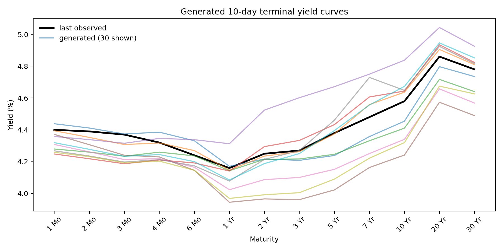

Removing each scenario's average maturity shift exposes the relevant geometry. Curves cross repeatedly and contain steepeners, flatteners, belly deformations, and local twists, showing that diversity is not produced only by parallel movement.

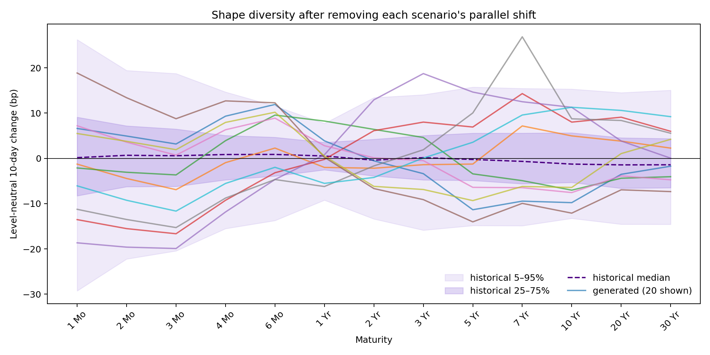

Most maturity changes lie inside the conditional historical 5–95% envelope. Because only ten paths are shown, individual boundary crossings should be treated as examples rather than calibrated exceedance frequencies.

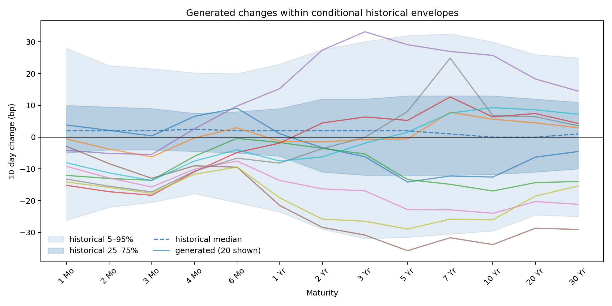

The factor comparison shows dispersion in level, 2s10s slope, and 2y–5y–10y curvature. The final generated means are -5.95, -0.27, and -2.68 bp, with standard deviations of 18.32, 8.72, and 7.03 bp. Four of ten paths fall outside at least one marginal 5–95% interval, but this joint statistic is particularly unstable at a sample size of ten.

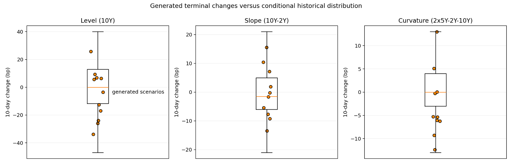

Pathwise factor plots verify temporal diversity rather than terminal-only separation. Several scenarios reverse direction during the horizon, and slope and curvature paths do not simply inherit the level path.

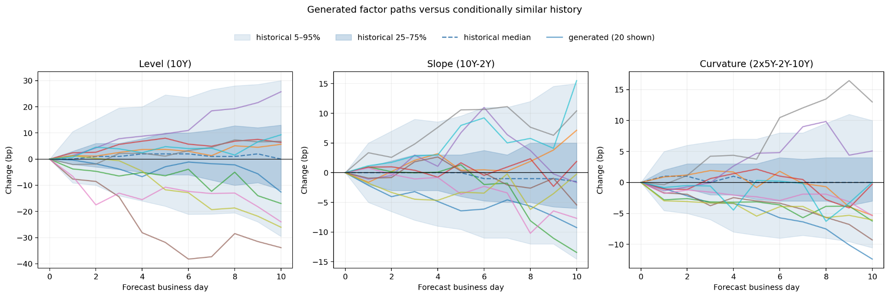

The generated shape-covariance matrix now recovers the main historical sign structure: positive dependence within the short end, positive dependence within the long end, and negative short-versus-long interaction after removing level. Its magnitude remains too small, with total shape variance at 43.7% of the historical target. This is an explicit remaining limitation rather than evidence that the model is fully calibrated.

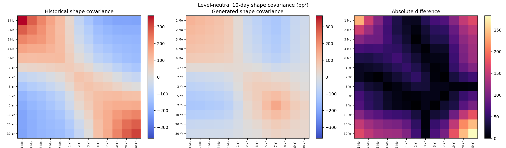

Daily correlation is substantially better matched than raw covariance. The Frobenius correlation error is 0.642, and the heatmaps reproduce the maturity-block structure without forcing tenors to move independently merely to make curves look different.

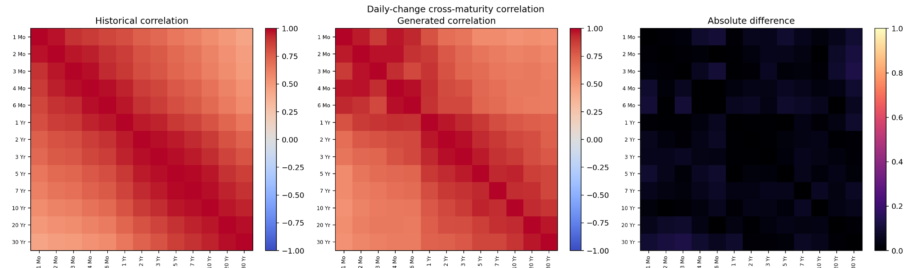

All ten generated changes lie near conditional historical observations in PCA space. Spread ratios are 0.43, 0.84, 0.60, and 0.65 for PC1–PC4. The figure is useful for detecting gross mode collapse, but ten points cannot estimate a four-dimensional distribution reliably.

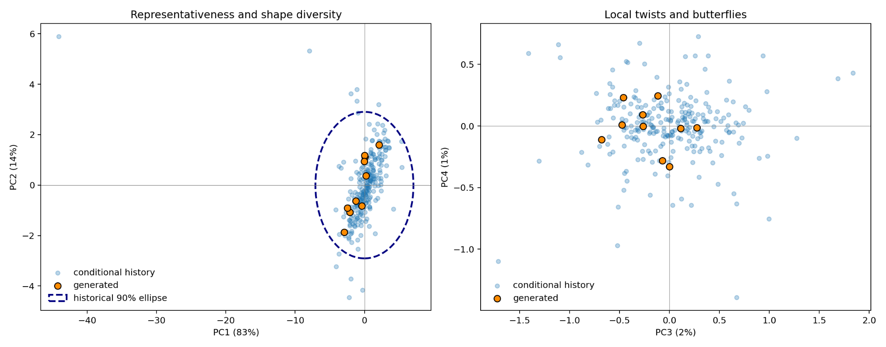

The machine-readable metrics for this run are stored in [`docs/final_evaluation/metrics_10_scenarios.json`](docs/final_evaluation/metrics_10_scenarios.json).

### Realism diagnostics

- distributions of daily changes by maturity;
- volatility term structure;
- level, slope, and curvature distributions;
- cross-maturity correlation and covariance matrices;
- lag-one autocorrelation;
- PCA eigenvalue spectrum;
- continuity between the last context day and first generated day;
- maximum daily movement and path roughness.

### Diversity diagnostics

- terminal yield dispersion by maturity;
- pairwise distance between scenarios from the same context;
- dispersion of level, slope, and curvature;
- sensitivity of generated paths to latent noise;
- expert usage and regime entropy.

Generating only ten scenarios gives a useful visualisation but an unstable estimate of tail behaviour. Quantitative evaluation should use at least 100 scenarios per test context, even though the submitted example contains the ten scenarios requested by the task.

Unconditional comparison with the complete 1990–2024 level distribution is not an appropriate measure for scenarios anchored to a 2024 context. Conditional evaluation should compare generated changes with historical ten-day changes starting from similar level, slope, curvature, and recent volatility.

## Assumptions and constraints

- Observations are treated as business-day sequences. The model does not attempt to simulate weekends or holidays.
- The supplied rates are modelled as a multivariate par-yield curve, not as bootstrapped zero-coupon discount factors.
- Missing maturities are interpolated across maturity within a date. No future observation is used to fill a past curve.
- The three-day context is the only conditioning information. Macroeconomic announcements, policy rates, inflation, and trading-volume variables are not included.
- Nelson–Siegel decay is fixed in the default configuration for stability and identifiability.
- Regime identities are latent and identifiable only up to permutation.
- The model is intended for research scenario generation, not trading or valuation without additional calibration and validation.

## Limitations

### Limited conditioning information

Three days may not distinguish persistent macroeconomic regimes. The regime encoder can only infer state from the recent curve itself.

### No strict no-arbitrage guarantee

Smooth par-yield curves are not equivalent to arbitrage-free discount curves. A genuine no-arbitrage constraint would require instrument conventions and a differentiable bootstrapping layer.

### Historical missingness

Interpolating tenors that were not published in early history creates usable rectangular data but can understate uncertainty at those maturities.

### GAN optimisation

WGAN-GP is more stable than a vanilla GAN but remains sensitive to critic strength, loss weights, learning rate, and random seed. Low critic loss does not imply good scenario calibration.

### Aggressive heavy-tailed priors

Large Student-\(t\) shocks improve exploration but can create implausible paths or destabilise the critics. Prior scale is therefore treated as a tunable stress parameter, not as a substitute for diversity objectives. Results must be checked against historical conditional volatility and tail movements.

### Evaluation sample size

Ten requested scenarios are insufficient for reliable coverage, covariance, PCA spread, or tail-risk estimates. A covariance estimate from ten curves has at most rank nine, and one scenario changes an empirical exceedance rate by ten percentage points. The ten-scenario figures are therefore submission examples; model selection requires at least 100 scenarios per context, several contexts, and several training seeds.

## Future work

The current version uses straight-through Gumbel–Softmax during training and categorical regime sampling during inference. A useful extension would replace the fixed Student-\(t\) degrees of freedom and regime scales with calibrated or learned conditional distributions.

The highest-priority next step is to repeat evaluation with at least 100 scenarios and three or more seeds. Checkpoint selection should report a Pareto table covering realism, within-context shape variance, covariance error, correlation error, factor coverage, and daily tails rather than selecting one visually attractive run.

Other useful extensions include:

1. a Transformer or state-space decoder as a higher-capacity alternative to the autoregressive GRUCell;
2. rolling conditional coverage, energy-score, and variogram-score evaluation;
3. nearest-neighbour conditional historical bootstrap and dynamic Nelson–Siegel baselines;
4. diffusion or flow-matching baselines to test whether the remaining diversity problem is specific to adversarial training;
5. missingness-aware training rather than deterministic interpolation;
6. macroeconomic and policy-rate conditioning;
7. differentiable discount-curve bootstrapping and soft no-arbitrage penalties;
8. systematic ablation of regimes, spline targets, dual critics, whitening, trace matching, and within-context centring;
9. context-specific historical covariance targets computed from training-only nearest neighbours rather than one aggregate historical target;
10. calibration curves showing how covariance and tail metrics stabilise as the number of generated scenarios increases from 10 to 1,000.

## Use of AI tools

AI coding assistance was used to brainstorm the regime-aware WGAN-GP, scaffold the package, propose diagnostics, review tensor shapes and leakage risks, implement author-approved changes, write tests, run smoke checks, and draft documentation. It was not used as an automatic model-selection authority.

### Author-led contributions and interventions

The direction of the iterative work was driven by the author's repeated inspection of generated curves:

1. The author rejected the initial output as too parallel even though numerical dispersion was non-zero.
2. The author requested higher complexity, much larger noise, and a large variance prior to stress-test whether stochastic capacity was the bottleneck.
3. After observing excessive variance, the author requested historical representativeness plots rather than relying on visual diversity alone.
4. The author identified that terminal curves still shared a common shape and requested explicit non-parallel diversity.
5. The author requested PC4 and shape-covariance improvement after PC1–PC2 diagnostics proved insufficient.
6. The author challenged the persistently pale generated covariance heatmap, which led to discovery of the mixed-context training versus fixed-context evaluation mismatch.

These interventions materially changed the project from a generic factor GAN into a model with an orthogonal spline representation, PC3–PC4 diagnostics, path-level spline targets, within-context covariance matching, and trace calibration.

### AI proposals that were accepted

- chronological train/validation/test splitting to prevent overlap leakage;
- separate temporal and maturity-shape critics;
- path-level and daily Student-t noise;
- latent regimes sampled with straight-through Gumbel–Softmax;
- conditional historical neighbours for evaluation;
- an orthogonal spline residual basis rather than independent maturity noise;
- PCA, correlation, factor-path, level-neutral, and covariance diagnostics;
- variance whitening for weak modes and a separate trace loss for total shape energy;
- unit tests, linting, and end-to-end smoke tests after each structural change.

### Disagreements and rejected suggestions

The first AI assessment placed too much weight on non-zero dispersion and initially described the generated scenarios as sufficiently diverse. The author's visual diagnosis was correct: most movement was parallel and economically redundant. That assessment was revised, and subsequent decisions used level-neutral and covariance diagnostics.

Simply increasing generic noise was also rejected as a final solution. The experiment requested by the author was useful because it demonstrated the failure: factor volatility became excessive without solving conditional shape calibration. Later changes targeted the representation and objective instead.

The project does not describe smooth generated par-yield curves as arbitrage-free. Smoothness is not an arbitrage guarantee; differentiable bootstrapping and instrument conventions would be required. It also does not claim that ten scenarios validate tail risk or covariance.

All AI-assisted code was executed and reviewed. Fourteen unit tests and the complete train–generate–evaluate smoke pipeline pass.
